# Диаграмма кооперации FinFlow - От регистрации до разделения трат

```mermaid
sequenceDiagram
    participant U as Пользователь
    participant FE as Frontend
    participant FFAUTH as ff-auth (Аутентификация)
    participant FFID as ff-id (Идентификация)
    participant FFTVM as ff-tvm (Service Auth)
    participant FFSPLIT as ff-split (Разделение трат)
    participant FFFILES as ff-files (Файлы)
    participant DB as База данных

    %% Этап 1: Регистрация пользователя
    Note over U, DB: Этап 1: Регистрация пользователя
    U->>FE: Заполняет форму регистрации
    FE->>FFAUTH: POST /auth/register {email, password, nickname}
    
    FFAUTH->>DB: Проверка уникальности email/nickname
    DB-->>FFAUTH: Результат проверки
    
    FFAUTH->>FFAUTH: Хеширование пароля (bcrypt)
    FFAUTH->>DB: Создание пользователя в ff-auth
    DB-->>FFAUTH: Пользователь создан
    
    FFAUTH->>FFTVM: Получение TVM тикета
    FFTVM-->>FFAUTH: TVM тикет
    
    FFAUTH->>FFID: POST /internal/users/register {user_id, email, nickname}
    FFID->>DB: Создание профиля пользователя
    DB-->>FFID: Профиль создан
    FFID-->>FFAUTH: Успешная регистрация
    
    FFAUTH->>DB: Назначение роли "user"
    FFAUTH->>FFAUTH: Генерация JWT токенов (access/refresh)
    FFAUTH-->>FE: JWT токены + данные пользователя
    FE-->>U: Успешная регистрация

    %% Этап 2: Авторизация (если нужна)
    Note over U, DB: Этап 2: Авторизация
    U->>FE: Вход в систему
    FE->>FFAUTH: POST /auth/login {email/nickname, password}
    FFAUTH->>DB: Поиск пользователя
    DB-->>FFAUTH: Данные пользователя
    FFAUTH->>FFAUTH: Проверка пароля (bcrypt)
    FFAUTH->>FFAUTH: Генерация новых JWT токенов
    FFAUTH-->>FE: JWT токены + данные пользователя
    FE-->>U: Успешный вход

    %% Этап 3: Создание мероприятия
    Note over U, DB: Этап 3: Создание мероприятия
    U->>FE: Создание мероприятия
    FE->>FFSPLIT: POST /api/v1/event {name, description, members}
    Note over FE: Заголовок: Authorization: Bearer <JWT>
    
    FFSPLIT->>FFTVM: Валидация JWT токена
    FFTVM-->>FFSPLIT: Данные пользователя
    
    FFSPLIT->>FFTVM: Получение TVM тикета для ff-id
    FFTVM-->>FFSPLIT: TVM тикет
    
    FFSPLIT->>FFID: GET /api/users?ids=[...] (синхронизация пользователей)
    FFID-->>FFSPLIT: Данные пользователей
    
    FFSPLIT->>DB: Создание мероприятия
    DB-->>FFSPLIT: Мероприятие создано
    
    FFSPLIT->>DB: Создание dummy пользователей (если есть)
    FFSPLIT->>DB: Добавление участников в мероприятие
    DB-->>FFSPLIT: Участники добавлены
    
    FFSPLIT-->>FE: Данные созданного мероприятия
    FE-->>U: Мероприятие создано

    %% Этап 4: Добавление расходов/трат
    Note over U, DB: Этап 4: Добавление расходов
    U->>FE: Добавление расхода
    FE->>FFSPLIT: POST /api/v1/event/{id}/transaction
    Note over FE: {type, from_user, amount, portion, users, name}
    
    FFSPLIT->>FFTVM: Валидация JWT токена
    FFTVM-->>FFSPLIT: Данные пользователя
    
    FFSPLIT->>DB: Проверка существования мероприятия
    DB-->>FFSPLIT: Мероприятие найдено
    
    FFSPLIT->>FFSPLIT: Выбор стратегии расчета (percent/amount/units)
    FFSPLIT->>FFSPLIT: Расчет долей пользователей
    FFSPLIT->>FFSPLIT: Расчет долгов между участниками
    
    FFSPLIT->>DB: Создание транзакции
    FFSPLIT->>DB: Сохранение долей (transaction_shares)
    FFSPLIT->>DB: Сохранение долгов (debts)
    DB-->>FFSPLIT: Данные сохранены
    
    FFSPLIT-->>FE: Результат транзакции с долгами
    FE-->>U: Расход добавлен

    %% Этап 5: Загрузка чеков (опционально)
    Note over U, DB: Этап 5: Загрузка файлов чеков
    U->>FE: Загрузка чека
    FE->>FFFILES: POST /files/upload (multipart/form-data)
    
    FFFILES->>FFFILES: Валидация файла
    FFFILES->>FFFILES: Сохранение в MinIO
    FFFILES->>DB: Сохранение метаданных файла
    DB-->>FFFILES: Метаданные сохранены
    
    FFFILES-->>FE: UUID файла
    FE->>FFSPLIT: PATCH /api/v1/event/{id}/transaction/{id} (добавление file_id)
    FFSPLIT->>DB: Обновление транзакции
    DB-->>FFSPLIT: Обновлено
    FFSPLIT-->>FE: Успешно
    FE-->>U: Чек прикреплен

    %% Этап 6: Просмотр долгов
    Note over U, DB: Этап 6: Просмотр и оптимизация долгов
    U->>FE: Просмотр долгов мероприятия
    FE->>FFSPLIT: GET /api/v1/event/{id}/debts
    
    FFSPLIT->>FFTVM: Валидация JWT токена
    FFTVM-->>FFSPLIT: Данные пользователя
    
    FFSPLIT->>DB: Получение всех долгов по мероприятию
    DB-->>FFSPLIT: Список долгов
    
    FFSPLIT-->>FE: Список долгов
    FE-->>U: Отображение долгов

    %% Этап 7: Оптимизация долгов
    Note over U, DB: Этап 7: Оптимизация долгов
    U->>FE: Запрос оптимизации долгов
    FE->>FFSPLIT: POST /api/v1/event/{id}/optimize-debts
    
    FFSPLIT->>DB: Получение всех транзакций мероприятия
    DB-->>FFSPLIT: Список транзакций
    
    FFSPLIT->>FFSPLIT: Расчет общих балансов участников
    FFSPLIT->>FFSPLIT: Алгоритм оптимизации (минимизация переводов)
    FFSPLIT->>FFSPLIT: Генерация оптимальных схем погашения
    
    FFSPLIT->>DB: Сохранение оптимизированных долгов
    DB-->>FFSPLIT: Оптимизированные долги сохранены
    
    FFSPLIT-->>FE: Оптимизированные схемы расчетов
    FE-->>U: Показ оптимальных переводов

    %% Этап 8: Персональные долги пользователя
    Note over U, DB: Этап 8: Персональные долги
    U->>FE: Просмотр личных долгов
    FE->>FFSPLIT: GET /api/v1/event/{id}/debts/user/{user_id}
    
    FFSPLIT->>FFTVM: Валидация JWT токена
    FFTVM-->>FFSPLIT: Данные пользователя
    
    FFSPLIT->>DB: Получение долгов ОТ пользователя
    FFSPLIT->>DB: Получение долгов К пользователю
    DB-->>FFSPLIT: Персональные долги
    
    FFSPLIT-->>FE: Кому должен + кто должен пользователю
    FE-->>U: Персональный баланс

    %% Этап 9: Просмотр файлов чеков
    Note over U, DB: Этап 9: Просмотр файлов
    U->>FE: Просмотр чека транзакции
    FE->>FFFILES: GET /files/{uuid}/download
    
    FFFILES->>DB: Получение метаданных файла
    DB-->>FFFILES: Метаданные файла
    
    FFFILES->>FFFILES: Генерация временной подписанной ссылки (MinIO)
    FFFILES-->>FE: Подписанная ссылка или поток файла
    FE-->>U: Отображение/скачивание чека

    %% Этап 10: Управление профилем
    Note over U, DB: Этап 10: Управление профилем
    U->>FE: Обновление профиля
    FE->>FFID: PATCH /users/me {nickname, name, phone, etc.}
    
    FFID->>FFTVM: Валидация JWT токена
    FFTVM-->>FFID: Данные пользователя
    
    FFID->>DB: Проверка уникальности данных
    FFID->>DB: Обновление профиля пользователя
    DB-->>FFID: Профиль обновлен
    
    FFID-->>FE: Обновленные данные
    FE-->>U: Профиль обновлен

    Note over U, DB: Система обеспечивает полный цикл от регистрации до оптимизированного разделения трат
```

## Описание взаимодействия компонентов

### Микросервисы системы:
- **ff-auth**: Аутентификация и авторизация, управление сессиями
- **ff-id**: Управление профилями пользователей и идентификация
- **ff-split**: Основная бизнес-логика разделения трат и расчетов
- **ff-files**: Управление файлами (чеки, аватары) через MinIO
- **ff-tvm**: Ticket-based аутентификация между сервисами

### Ключевые алгоритмы:
1. **Стратегии разделения трат**:
   - Процентное распределение (percent)
   - Фиксированные суммы (amount) 
   - Распределение по долям (units)

2. **Оптимизация долгов**: 
   - Расчет общих балансов участников
   - Минимизация количества переводов
   - Генерация оптимальных схем погашения

### Безопасность:
- JWT токены для аутентификации пользователей
- TVM тикеты для межсервисного взаимодействия
- Валидация прав доступа на каждом этапе
