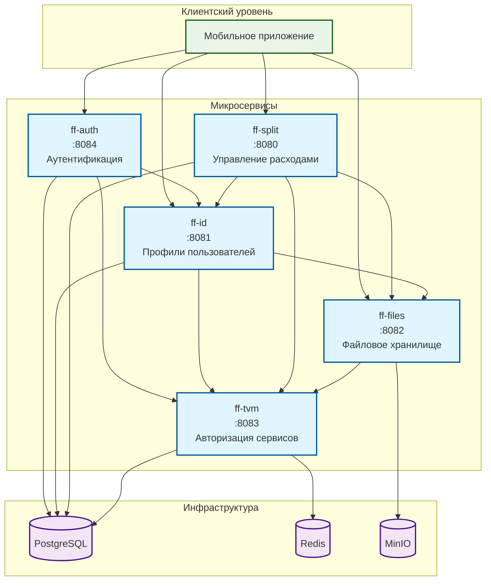
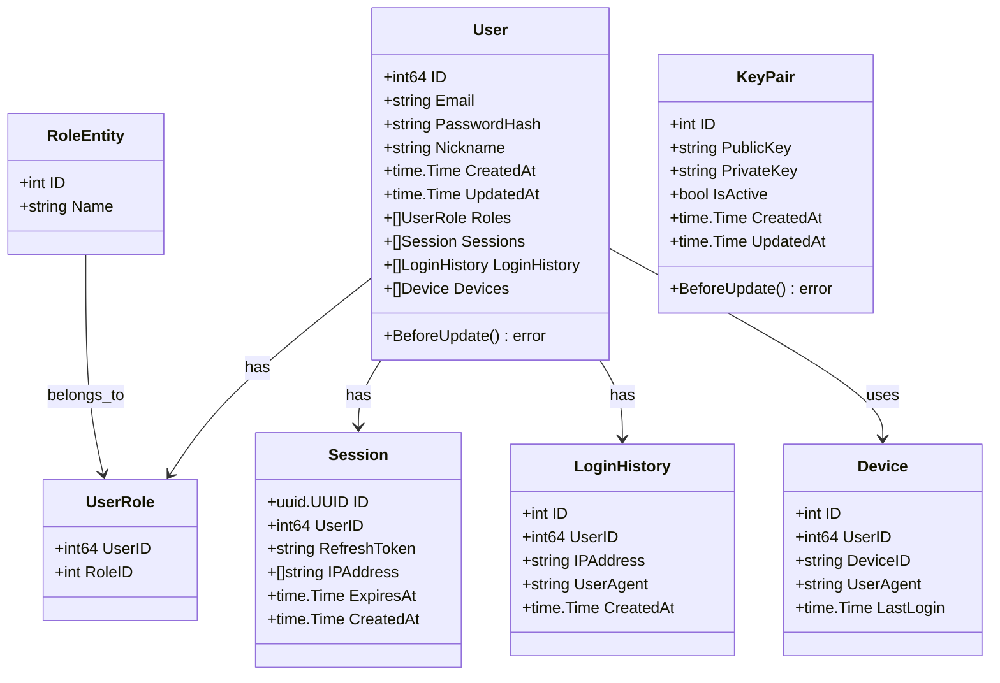
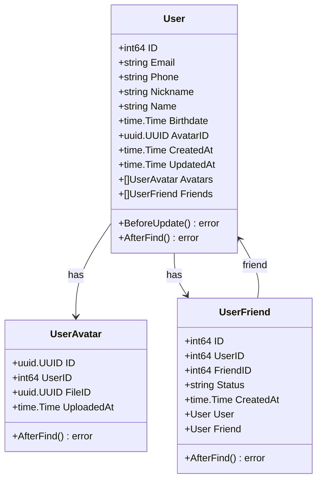
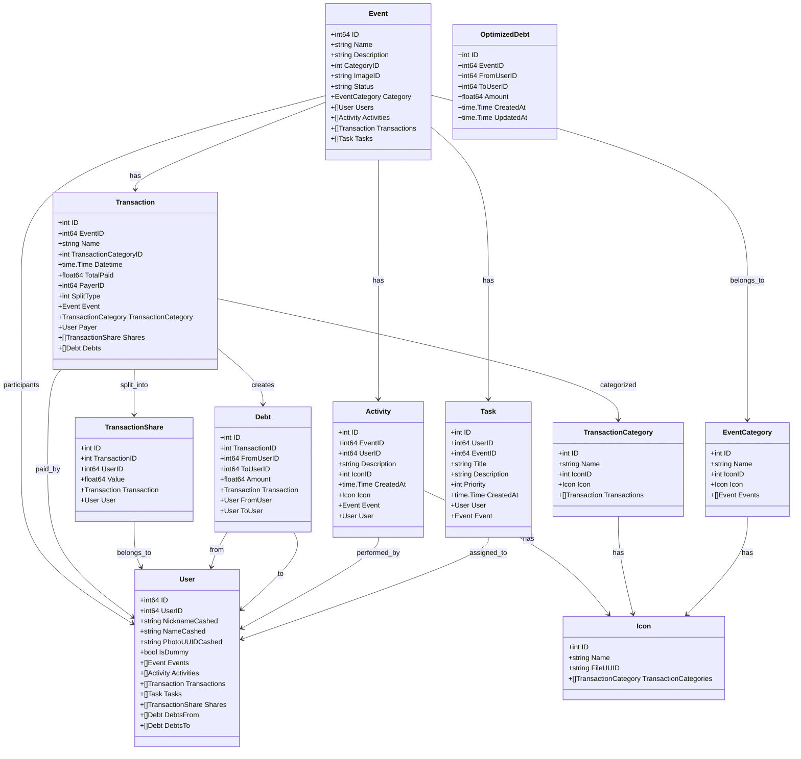
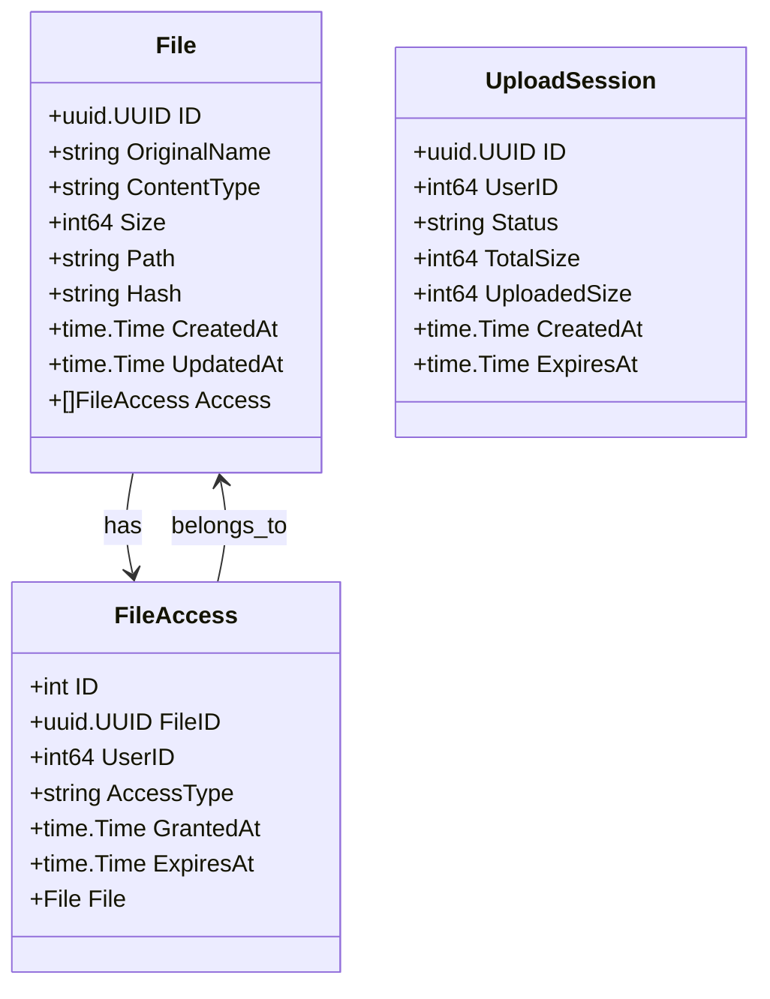
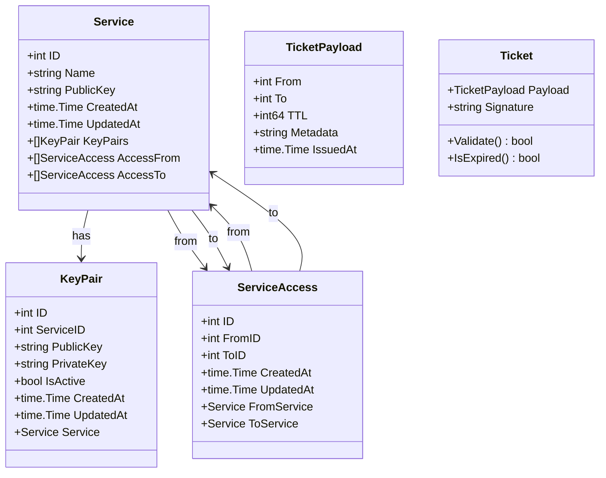
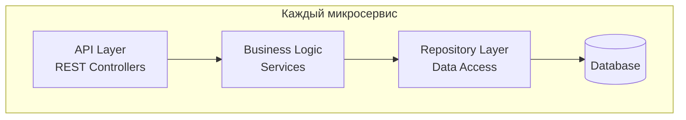
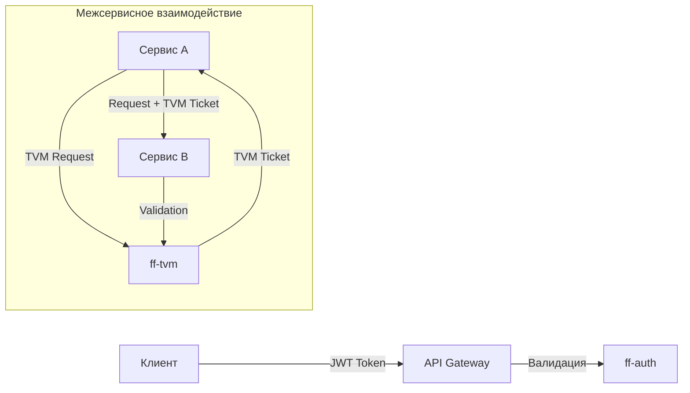

# Диаграммы сервисов FinFlow

## Диаграмма связи сервисов

## Диаграммы классов

### ff-auth - Сервис аутентификации

### ff-id - Сервис профилей пользователей

### ff-split - Сервис управления расходами

### ff-files - Сервис файлового хранилища

### ff-tvm - Сервис авторизации сервисов

## Архитектурные особенности

### Слоистая архитектура сервисов

### Модель безопасности

## Основные компоненты системы

### Уровни архитектуры

1. **Клиентский уровень**: Мобильное приложение
2. **Микросервисы**: Независимые сервисы с собственной БД
3. **Инфраструктура**: PostgreSQL, Redis, MinIO

### Принципы проектирования

- **Микросервисная архитектура**: Каждый сервис отвечает за свою доменную область
- **Database per Service**: У каждого сервиса своя база данных
- **API-First**: Все взаимодействие через REST API
- **Независимое развертывание**: Сервисы могут обновляться независимо
- **Отказоустойчивость**: Graceful degradation при недоступности сервисов

### Безопасность

- **JWT токены** для аутентификации пользователей
- **TVM тикеты** для межсервисной авторизации
- **ED25519 подписи** для криптографической защиты
- **HTTPS** для всех внешних соединений
- **Принцип минимальных привилегий** для доступа к ресурсам
