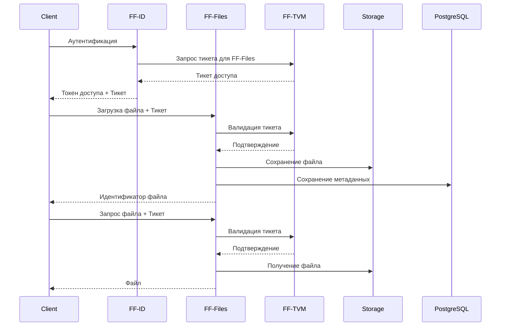
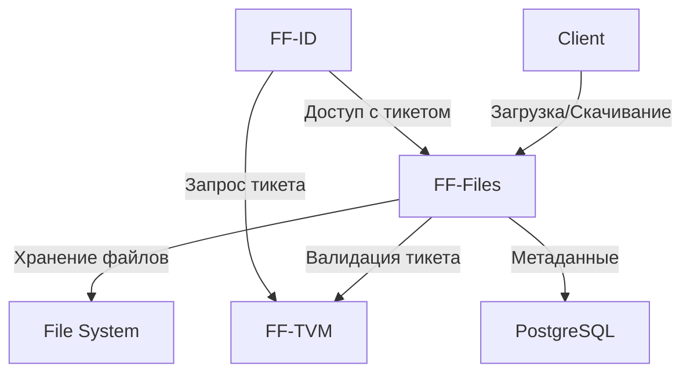

# FF-Files (File Storage Microservice)

FF-Files - это сервис для безопасного хранения и управления файлами в системе FinFlow. Сервис обеспечивает контроль доступа к файлам через интеграцию с FF-TVM.

## Архитектура



## Основные компоненты

1. **Менеджер файлов**
   - Загрузка файлов
   - Скачивание файлов
   - Удаление файлов
   - Управление метаданными

2. **Менеджер доступа**
   - Интеграция с FF-TVM
   - Проверка тикетов доступа
   - Управление правами доступа к файлам

3. **Хранилище**
   - Локальное хранение файлов
   - Управление директориями
   - Очистка временных файлов

## API

### Swagger Спецификация

```yaml
openapi: 3.0.0
info:
  title: FF-Files API
  version: 1.0.0
  description: API для управления файлами

paths:
  /files/upload:
    post:
      summary: Загрузка файла
      security:
        - TvmTicket: []
      requestBody:
        required: true
        content:
          multipart/form-data:
            schema:
              type: object
              properties:
                file:
                  type: string
                  format: binary
                metadata:
                  type: object
                  properties:
                    description:
                      type: string
      responses:
        '201':
          description: Файл успешно загружен
          content:
            application/json:
              schema:
                type: object
                properties:
                  id:
                    type: string
                  name:
                    type: string
                  size:
                    type: integer
                  created_at:
                    type: string
                    format: date-time

  /files/{id}:
    get:
      summary: Получение файла
      security:
        - TvmTicket: []
      parameters:
        - name: id
          in: path
          required: true
          schema:
            type: string
      responses:
        '200':
          description: Файл
          content:
            application/octet-stream:
              schema:
                type: string
                format: binary

    delete:
      summary: Удаление файла
      security:
        - TvmTicket: []
      parameters:
        - name: id
          in: path
          required: true
          schema:
            type: string
      responses:
        '200':
          description: Файл успешно удален

  /files/{id}/metadata:
    get:
      summary: Получение метаданных файла
      security:
        - TvmTicket: []
      parameters:
        - name: id
          in: path
          required: true
          schema:
            type: string
      responses:
        '200':
          description: Метаданные файла
          content:
            application/json:
              schema:
                type: object
                properties:
                  id:
                    type: string
                  name:
                    type: string
                  size:
                    type: integer
                  created_at:
                    type: string
                    format: date-time
                  metadata:
                    type: object

components:
  securitySchemes:
    TvmTicket:
      type: apiKey
      in: header
      name: X-TVM-Ticket
```

## Конфигурация

```yaml
server:
  port: ":8082"  # Порт сервера

database:
  host: "localhost"  # Хост PostgreSQL
  port: "5432"      # Порт PostgreSQL
  user: "postgres"  # Пользователь
  password: "postgres"  # Пароль
  dbname: "ff_files"  # Имя базы данных

storage:
  path: "/data/files"  # Путь для хранения файлов
  temp_path: "/data/temp"  # Путь для временных файлов
  max_file_size: "100MB"  # Максимальный размер файла

tvm:
  url: "http://ff-tvm:8081"  # URL сервиса TVM
```

## Диаграмма взаимодействия сервисов



## Безопасность

1. **Контроль доступа**
   - Валидация тикетов через FF-TVM
   - Проверка прав доступа к файлам
   - Изоляция файлов разных сервисов

2. **Хранение**
   - Безопасное хранение файлов
   - Разделение метаданных и контента
   - Очистка временных файлов

3. **Аудит**
   - Логирование операций с файлами
   - Отслеживание доступа к файлам
   - История изменений метаданных

## Развертывание

### Docker

```bash
# Сборка образа
docker build -t ff-files .

# Запуск
docker run -p 8082:8082 \
  -v /data/files:/data/files \
  -v /data/temp:/data/temp \
  -e DB_HOST=postgres \
  -e DB_PORT=5432 \
  -e TVM_URL=http://ff-tvm:8081 \
  ff-files
```

### Docker Compose

См. docker-compose.yml в корневой директории проекта.

## Разработка

### Требования

- Go 1.21+
- PostgreSQL 16+
- Достаточно места на диске для хранения файлов

### Локальный запуск

```bash
# Установка зависимостей
go mod download

# Запуск
go run cmd/app/main.go
```

### Тесты

```bash
go test ./...
``` 