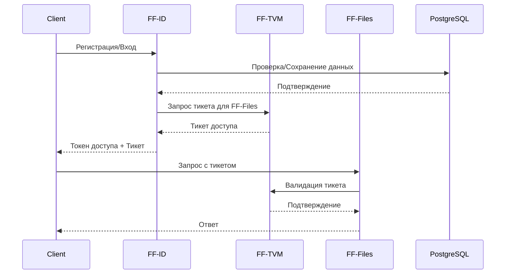
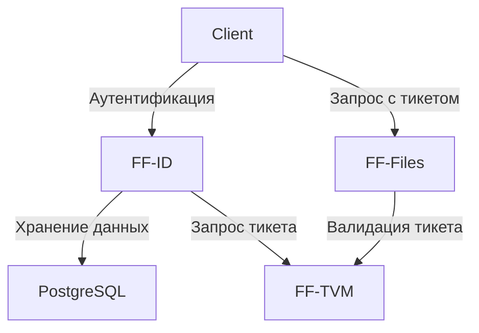

# FF-ID (Identity Management Microservice)

FF-ID - это сервис управления идентификацией и аутентификацией в системе FinFlow. Сервис обеспечивает безопасную аутентификацию пользователей и выдачу тикетов для доступа к другим сервисам через FF-TVM.

## Архитектура



## Основные компоненты

1. **Менеджер аутентификации**
   - Регистрация пользователей
   - Аутентификация
   - Управление сессиями
   - Восстановление пароля

2. **Менеджер тикетов**
   - Интеграция с FF-TVM
   - Получение тикетов для сервисов
   - Кеширование тикетов

3. **Менеджер профилей**
   - Управление профилями пользователей
   - Управление ролями и правами
   - Управление настройками

## API

### Swagger Спецификация

```yaml
openapi: 3.0.0
info:
  title: FF-ID API
  version: 1.0.0
  description: API для управления идентификацией

paths:
  /auth/register:
    post:
      summary: Регистрация пользователя
      requestBody:
        required: true
        content:
          application/json:
            schema:
              type: object
              properties:
                email:
                  type: string
                  format: email
                password:
                  type: string
                  format: password
                name:
                  type: string
      responses:
        '201':
          description: Пользователь зарегистрирован
          content:
            application/json:
              schema:
                type: object
                properties:
                  id:
                    type: integer
                  email:
                    type: string
                  name:
                    type: string
                  token:
                    type: string

  /auth/login:
    post:
      summary: Вход в систему
      requestBody:
        required: true
        content:
          application/json:
            schema:
              type: object
              properties:
                email:
                  type: string
                  format: email
                password:
                  type: string
                  format: password
      responses:
        '200':
          description: Успешный вход
          content:
            application/json:
              schema:
                type: object
                properties:
                  token:
                    type: string
                  user:
                    type: object
                    properties:
                      id:
                        type: integer
                      email:
                        type: string
                      name:
                        type: string

  /auth/refresh:
    post:
      summary: Обновление токена
      security:
        - BearerAuth: []
      responses:
        '200':
          description: Токен обновлен
          content:
            application/json:
              schema:
                type: object
                properties:
                  token:
                    type: string

  /auth/logout:
    post:
      summary: Выход из системы
      security:
        - BearerAuth: []
      responses:
        '200':
          description: Успешный выход

  /profile:
    get:
      summary: Получение профиля
      security:
        - BearerAuth: []
      responses:
        '200':
          description: Профиль пользователя
          content:
            application/json:
              schema:
                type: object
                properties:
                  id:
                    type: integer
                  email:
                    type: string
                  name:
                    type: string
                  settings:
                    type: object

    put:
      summary: Обновление профиля
      security:
        - BearerAuth: []
      requestBody:
        required: true
        content:
          application/json:
            schema:
              type: object
              properties:
                name:
                  type: string
                settings:
                  type: object
      responses:
        '200':
          description: Профиль обновлен

components:
  securitySchemes:
    BearerAuth:
      type: http
      scheme: bearer
      bearerFormat: JWT
```

## Конфигурация

```yaml
server:
  port: ":8081"  # Порт сервера

database:
  host: "localhost"  # Хост PostgreSQL
  port: "5432"      # Порт PostgreSQL
  user: "postgres"  # Пользователь
  password: "postgres"  # Пароль
  dbname: "ff_id"  # Имя базы данных

jwt:
  signing_key: "your-secret-key"  # Ключ для подписи JWT
  expiration: "24h"  # Время жизни токена

tvm:
  url: "http://ff-tvm:8081"  # URL сервиса TVM
  service_id: 1  # ID сервиса в TVM
```

## Диаграмма взаимодействия сервисов



## Безопасность

1. **Аутентификация**
   - Безопасное хранение паролей (bcrypt)
   - JWT токены для сессий
   - Двухфакторная аутентификация (опционально)

2. **Авторизация**
   - Ролевая модель доступа
   - Интеграция с FF-TVM
   - Проверка прав доступа

3. **Защита данных**
   - Шифрование чувствительных данных
   - Защита от брутфорс атак
   - Rate limiting

## Развертывание

### Docker

```bash
# Сборка образа
docker build -t ff-id .

# Запуск
docker run -p 8081:8081 \
  -e DB_HOST=postgres \
  -e DB_PORT=5432 \
  -e TVM_URL=http://ff-tvm:8081 \
  -e JWT_KEY=your-secret-key \
  ff-id
```

### Docker Compose

См. docker-compose.yml в корневой директории проекта.

## Разработка

### Требования

- Go 1.21+
- PostgreSQL 16+
- FF-TVM для интеграции

### Локальный запуск

```bash
# Установка зависимостей
go mod download

# Запуск
go run cmd/app/main.go
```

### Тесты

```bash
go test ./...
``` 