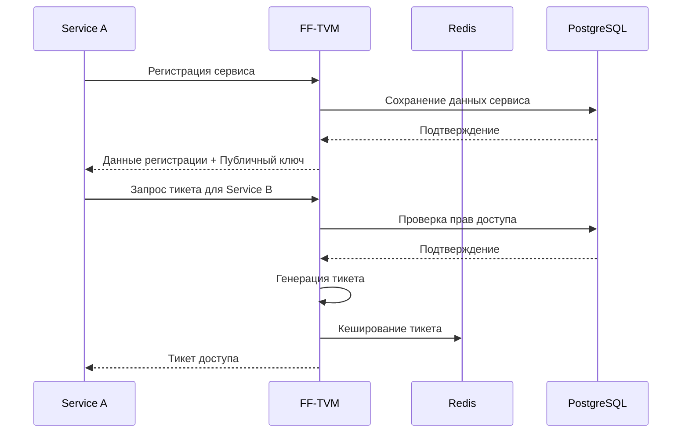
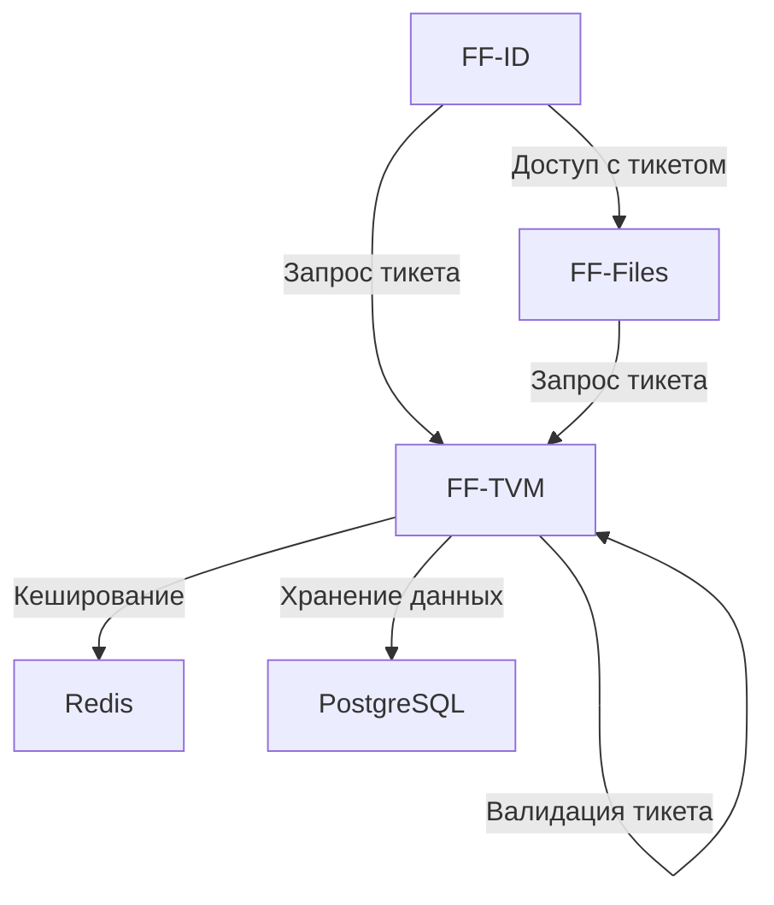

# FF-TVM (Ticket Validation Microservice)

FF-TVM - это сервис управления доступом между микросервисами в системе FinFlow. Он использует Ed25519 для подписи и проверки тикетов доступа.

## Архитектура



## Основные компоненты

1. **Менеджер ключей**
   - Генерация пар ключей Ed25519
   - Ротация ключей
   - Хранение истории ключей

2. **Менеджер доступа**
   - Управление правами доступа между сервисами
   - Валидация запросов на доступ
   - Аудит доступа

3. **Менеджер тикетов**
   - Выдача тикетов доступа
   - Валидация тикетов
   - Кеширование тикетов в Redis

## API

### Swagger Спецификация

```yaml
openapi: 3.0.0
info:
  title: FF-TVM API
  version: 1.0.0
  description: API для управления доступом между микросервисами

paths:
  /tvm/register:
    post:
      summary: Регистрация нового сервиса
      requestBody:
        required: true
        content:
          application/json:
            schema:
              type: object
              properties:
                name:
                  type: string
                description:
                  type: string
      responses:
        '201':
          description: Сервис успешно зарегистрирован
          content:
            application/json:
              schema:
                type: object
                properties:
                  id:
                    type: integer
                  name:
                    type: string
                  description:
                    type: string
                  public_key:
                    type: string

  /tvm/access/grant:
    post:
      summary: Предоставление доступа
      requestBody:
        required: true
        content:
          application/json:
            schema:
              type: object
              properties:
                source_service_id:
                  type: integer
                target_service_id:
                  type: integer
      responses:
        '200':
          description: Доступ успешно предоставлен

  /tvm/access/revoke:
    post:
      summary: Отзыв доступа
      requestBody:
        required: true
        content:
          application/json:
            schema:
              type: object
              properties:
                source_service_id:
                  type: integer
                target_service_id:
                  type: integer
      responses:
        '200':
          description: Доступ успешно отозван

  /tvm/ticket/issue:
    post:
      summary: Выдача тикета
      requestBody:
        required: true
        content:
          application/json:
            schema:
              type: object
              properties:
                source_service_id:
                  type: integer
                target_service_id:
                  type: integer
      responses:
        '200':
          description: Тикет успешно выдан
          content:
            application/json:
              schema:
                type: object
                properties:
                  ticket:
                    type: string

  /tvm/ticket/validate:
    post:
      summary: Валидация тикета
      requestBody:
        required: true
        content:
          application/json:
            schema:
              type: object
              properties:
                ticket:
                  type: string
      responses:
        '200':
          description: Тикет валиден
          content:
            application/json:
              schema:
                type: object
                properties:
                  claims:
                    type: object

  /tvm/key/{service_id}:
    get:
      summary: Получение публичного ключа сервиса
      parameters:
        - name: service_id
          in: path
          required: true
          schema:
            type: integer
      responses:
        '200':
          description: Публичный ключ получен
          content:
            application/json:
              schema:
                type: object
                properties:
                  public_key:
                    type: string

    post:
      summary: Ротация ключей сервиса
      parameters:
        - name: service_id
          in: path
          required: true
          schema:
            type: integer
      responses:
        '200':
          description: Ключи успешно обновлены
```

## Формат тикета

```json
{
  "claims": {
    "source_id": 1,
    "target_id": 2,
    "issued_at": 1234567890,
    "expires_at": 1234571490
  },
  "signature": "base64-encoded-ed25519-signature"
}
```

## Конфигурация

```yaml
server:
  port: ":8081"  # Порт сервера

database:
  host: "localhost"  # Хост PostgreSQL
  port: "5432"      # Порт PostgreSQL
  user: "postgres"  # Пользователь
  password: "postgres"  # Пароль
  dbname: "ff_tvm"  # Имя базы данных

redis:
  host: "localhost"  # Хост Redis
  port: "6379"      # Порт Redis
  password: ""      # Пароль Redis
  db: 0            # Номер базы данных

tvm:
  ticket_ttl: "1h"  # Время жизни тикета
```

## Диаграмма взаимодействия сервисов



## Безопасность

1. **Криптография**
   - Ed25519 для подписи/проверки тикетов
   - Безопасное хранение приватных ключей
   - Регулярная ротация ключей

2. **Валидация**
   - Проверка срока действия тикетов
   - Проверка подписи
   - Проверка прав доступа

3. **Аудит**
   - Логирование всех операций
   - История ротаций ключей
   - Отслеживание попыток несанкционированного доступа

## Развертывание

### Docker

```bash
# Сборка образа
docker build -t ff-tvm .

# Запуск
docker run -p 8081:8081 \
  -e DB_HOST=postgres \
  -e DB_PORT=5432 \
  -e REDIS_HOST=redis \
  ff-tvm
```

### Docker Compose

См. docker-compose.yml в корневой директории проекта.

## Разработка

### Требования

- Go 1.21+
- PostgreSQL 16+
- Redis 7+

### Локальный запуск

```bash
# Установка зависимостей
go mod download

# Запуск
go run cmd/app/main.go
```

### Тесты

```bash
go test ./...
``` 